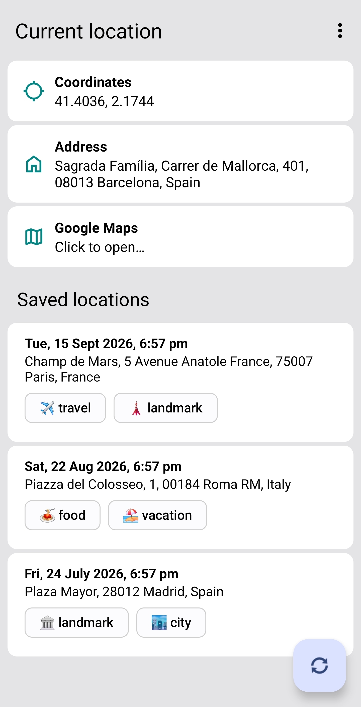
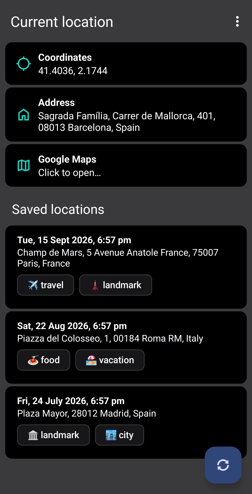

# GeoLocator

Simple Android app for retrieving, displaying, and saving current geolocation information.

| Light theme | Dark theme |
|:-----------:|:----------:|
|  |  |

## Features
- Retrieve current geolocation (coordinates and address)
- Save location for future reference

## Installation
1. Clone the repository
2. Open the project in Android Studio
3. Build and run the app on an emulator or physical device

## Usage
1. Open the app on your device
2. Grant location permissions if prompted
3. View your current location on the map
4. Save the location for future reference